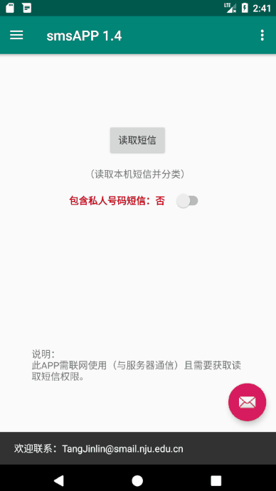
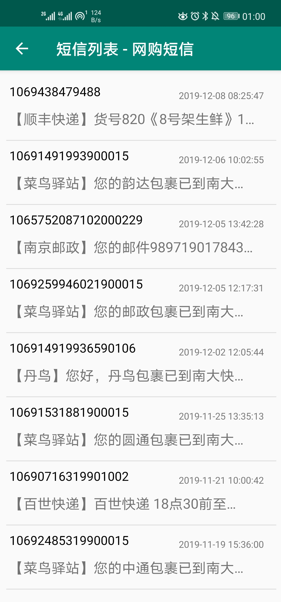
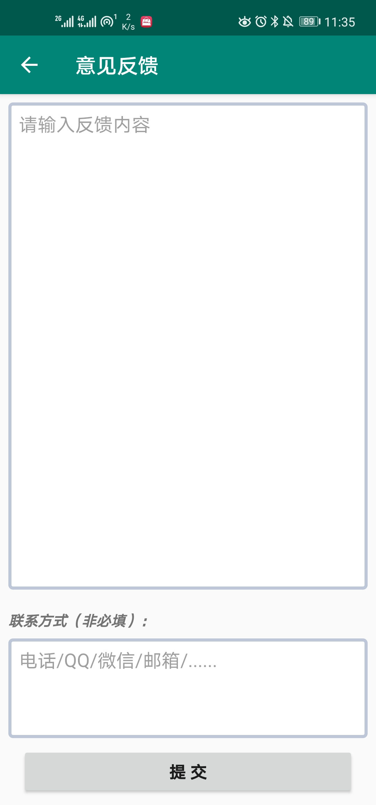
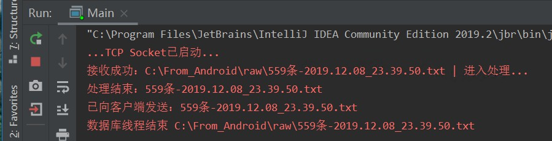
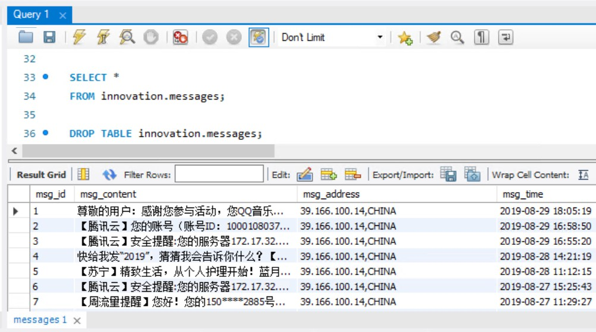

# 基于Android平台的短信安全评估与加密保护系统

 —— 南京大学2018-2019大学生创新创业训练项目

（APP客户端部分）  

**安装包（APK文件）**
[下载地址](https://github.com/NJU-TJL/smsAPP-Android/releases)

**关于源代码的使用**

编译生成前，请先搜索"TODO-FIRST"（[MainActivity.java](https://github.com/NJU-TJL/smsAPP-Android/blob/master/app/src/main/java/com/example/jinlin/smsappv1/MainActivity.java) 和 [FeedbackActivity.java](https://github.com/NJU-TJL/smsAPP-Android/blob/master/app/src/main/java/com/example/jinlin/smsappv1/FeedbackActivity.java) 文件中），按注释提示信息，填入必要信息（服务器IP地址等）。

注：[源代码](https://github.com/NJU-TJL/smsAPP-Android/tree/master/app/src/main/java/com/example/jinlin/smsappv1)中，出于安全考虑，已去除原本使用的服务器公网IP地址，以及用于接收反馈信息的我的个人邮箱。所以，如果需要复用代码，请按注释填入相关信息，否则部分相关功能无法正常使用。如有任何问题，欢迎[联系我](mailto:TangJinlin@smail.nju.edu.cn)）

**转载请注明原作者：https://github.com/NJU-TJL/smsAPP-Android**  

（使用Apache 2.0开源协议）

## 项目信息

**项目名称: 基于 Android 平台的短信安全评估与加密保护系统**  

**项目组成员**

1、胡天翔  计算机科学与技术系  2017级

2、汪铭潇  计算机科学与技术系  2017级

3、刘晨宇  计算机科学与技术系  2017级

4、唐金麟  计算机科学与技术系  2017级

**指导老师：**        

1、华景煜   计算机科学与技术系   副教授

**立项年份:**    2018

**联系电邮： TangJinlin@smail.nju.edu.cn**

**项目背景：**
一个供Android用户使用的短信辅助系统（包含APP端和服务器端）。其中涉及的较为关键的技术有：短信文本处理、分类，Android开发，服务器通信，数据库等。

**具体工作：**
①收集相关文献信息，调研了安卓短信处理方向上近几年的研究状况。②搜寻了一些开源项目（比如中文分词系统、Android端展示图表等）以便利用到本项目中。③完成了短信分类算法的自主实现，之后分工完成了APP端、服务器端代码的实现（其中APP端主体Java代码2986行），购置了一台云服务器（1年期）并且完成了部署。④不断优化APP的界面，实现良好的UI交互。

**心得体会：** 
项目最终实现了一个较为完整且具有一定实用性的系统。在项目推进过程中，遇到的众多Bug也极大地增强了代码实战能力。

## 部分功能展示

（注：如果图片加载失败，可能是网络较慢的原因，可耐心等待一会儿；或者可以在[ImageMD文件夹](https://github.com/NJU-TJL/smsAPP-Android/tree/master/ImageMD)中下载后查看）

主界面及侧边栏

短信词频展示

短信分类展示

意见反馈

服务器端程序运行效果展示

短信MySQL数据库部分内容展示

